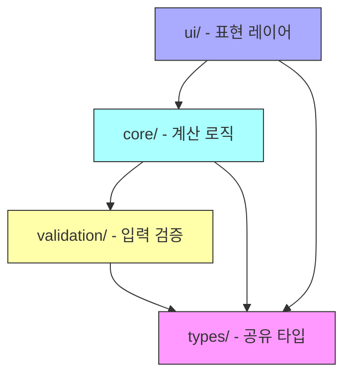
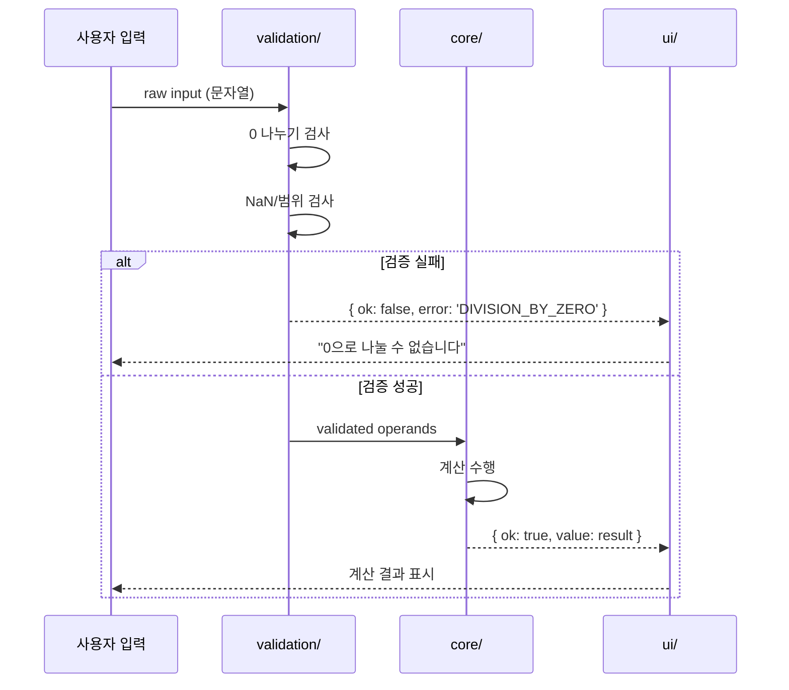
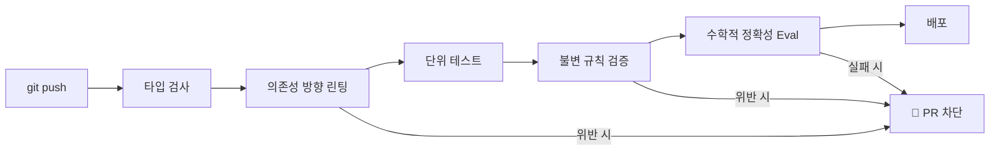

# ARCHITECTURE.md — 기술 및 운영 아키텍처

---

## 아키텍처 철학

> **"제약이 에이전트의 생산성을 높인다."**
> 자유롭게 두면 에이전트는 나쁜 패턴을 복제하고 기술 부채를 쌓는다.
> 명확한 경계와 강제 규칙이 있을 때 에이전트는 올바른 방향으로 빠르게 움직인다.

---

## 레이어 아키텍처



### 의존성 방향 규칙

| 레이어 | 가능한 import | 불가능한 import |
|---|---|---|
| `types/` | 없음 (최하위) | 모든 레이어 |
| `validation/` | `types/` | `core/`, `ui/` |
| `core/` | `types/`, `validation/` | `ui/` |
| `ui/` | `types/`, `core/` | ~~`validation/` 직접 호출~~ |

> **린터가 역방향 import를 자동 차단한다.**

---

## 모듈 책임 정의

### `types/` — 공유 타입 (진실의 단일 원천)
```typescript
// 핵심 타입 예시
type Operand = number;
type Operator = '+' | '-' | '*' | '/';
type CalculationResult =
  | { ok: true; value: number }
  | { ok: false; error: CalcError };

type CalcError =
  | 'DIVISION_BY_ZERO'   // [INV-1] 0 나누기
  | 'OVERFLOW'           // 계산 결과가 Number.MAX_SAFE_INTEGER 초과
  | 'INVALID_INPUT'      // 숫자가 아닌 입력
  | 'NAN_RESULT';        // NaN 결과
```

### `validation/` — 입력 방어선
- 모든 사용자 입력의 **첫 번째 관문**
- 분모 0 검사 → `DIVISION_BY_ZERO` 에러 반환
- NaN/Infinity 검사
- 입력 범위 검사 (Number.MIN_SAFE_INTEGER ~ Number.MAX_SAFE_INTEGER)

### `core/` — 순수 계산 함수
- **부수 효과(side effect) 없는 순수 함수만 허용**
- 입력은 이미 검증된 값이라고 가정 (validation/ 통과 후)
- 계산 결과는 항상 `CalculationResult` 타입 반환

```
add(a, b)        → CalculationResult
subtract(a, b)   → CalculationResult
multiply(a, b)   → CalculationResult
divide(a, b)     → CalculationResult  // b=0이면 DIVISION_BY_ZERO
```

### `ui/` — 표현 레이어
- 상태 관리 및 사용자 인터랙션
- `core/` 함수 호출 → 결과를 사용자에게 표시
- 에러 코드를 사용자 친화적 메시지로 변환

---

## 피드백 루프 아키텍처



---

## CI/CD 파이프라인



**모든 게이트를 통과해야만 머지 가능.**

---

## 기술 스택

| 구분 | 기술 | 이유 |
|---|---|---|
| 언어 | TypeScript | 타입 안전성, 의존성 방향 린팅 용이 |
| 테스트 | Jest + fast-check (property-based) | 수학적 속성 검증 |
| 린팅 | ESLint + eslint-plugin-import | 레이어 경계 강제 |
| CI | GitHub Actions | 자동화된 피드백 루프 |

---

> 불변 규칙 상세 → [`docs/invariants.md`](docs/invariants.md)
> 신뢰성 기준 → [`RELIABILITY.md`](RELIABILITY.md)
