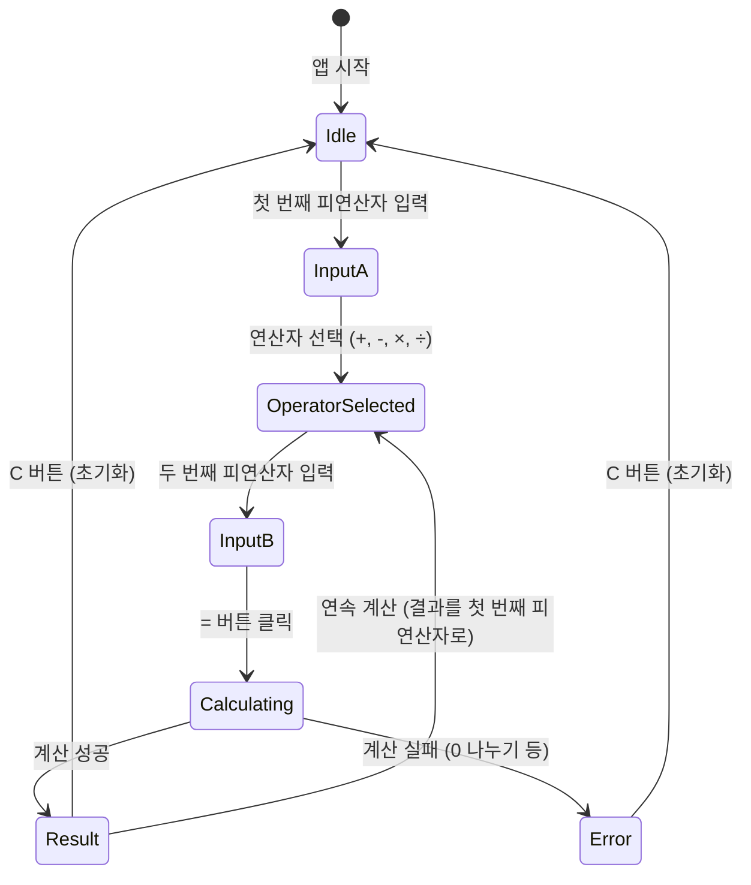

# DESIGN.md — UX/UI 설계 표준

---

## 디자인 철학

> **"계산기는 도구다. 사용자가 도구에 대해 생각하지 않게 만드는 것이 좋은 디자인이다."**

사용자의 인지 부하(cognitive load)를 최소화하고,
오류 발생 시 혼란이 아닌 **명확한 복구 경로**를 제공한다.

---

## 컴포넌트 구조

```
ui/
├── Calculator.tsx       # 최상위 컴포넌트 (상태 관리)
├── Display.tsx          # 입력/결과 표시 영역
├── Keypad.tsx           # 숫자 + 연산자 버튼
├── ErrorMessage.tsx     # 에러 메시지 표시
└── HistoryPanel.tsx     # 계산 히스토리 (옵션)
```

---

## 에러 메시지 표준

**에러 코드 → 사용자 메시지 매핑 (ui/ 레이어의 책임)**

| 에러 코드 | 한국어 메시지 | 영어 메시지 |
|---|---|---|
| `DIVISION_BY_ZERO` | ⚠️ 0으로 나눌 수 없습니다 | Cannot divide by zero |
| `INVALID_INPUT` | 숫자를 입력해주세요 | Please enter a number |
| `OVERFLOW` | 숫자가 너무 큽니다 | Number is too large |
| `NAN_RESULT` | 계산할 수 없는 값입니다 | Result is not a number |

### 에러 표시 원칙
1. **색상**: 빨간색(#D32F2F) — 그러나 색맹 접근성을 위해 아이콘(⚠️)을 병행
2. **위치**: 입력 필드 바로 아래 (사용자 시선 경로)
3. **지속 시간**: 사용자가 다음 입력을 시작할 때까지 유지
4. **복구**: 에러 후 입력 필드를 초기화하지 않는다 (사용자가 수정할 수 있게)

---

## 인터랙션 플로우



---

## 키보드 접근성

| 키 | 동작 |
|---|---|
| `0-9` | 숫자 입력 |
| `+`, `-`, `*`, `/` | 연산자 선택 |
| `Enter` | 계산 실행 |
| `Escape` | 초기화 |
| `Backspace` | 마지막 입력 삭제 |

---

## 반응형 디자인

- **데스크탑**: 계산기 + 히스토리 사이드 패널
- **태블릿**: 계산기 단독 (히스토리는 드로어)
- **모바일**: 계산기 전체 화면, 큰 버튼 (최소 44×44px)

---

## 접근성 (WCAG 2.1 AA 준수)

- 모든 버튼: `aria-label` 필수
- 에러 메시지: `role="alert"` (스크린리더 즉시 읽기)
- 결과 표시: `aria-live="polite"`
- 색상 대비: 최소 4.5:1

---

> 제품 요구사항 → [`PRODUCT_SENSE.md`](PRODUCT_SENSE.md)
> 디자인 상세 문서 → [`docs/design/`](docs/design/)
