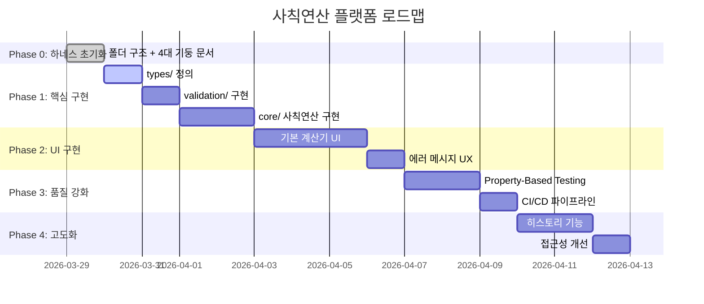

# PLANS.md — 상태 기반 로드맵

> **이 파일은 프로젝트의 "살아있는 로드맵"이다.**
> 완료된 계획은 `docs/exec-plans/completed/`로 이동한다.
> 새 기능 추가 전 반드시 이 파일에 계획을 먼저 등록한다.

---

## 프로젝트 단계 (Phases)



---

## 현재 활성 계획 (Active)

| ID | 제목 | 상태 | 링크 |
|---|---|---|---|
| TASK-00 | 하네스 초기화 (폴더 구조 + 4대 기둥 문서) | ✅ 완료 | [`exec-plans/active/task-00-setup.md`](docs/exec-plans/active/task-00-setup.md) |
| TASK-01 | types/ 공유 타입 정의 + 툴체인 초기화 | ✅ 완료 | `types/calc.ts`, `tsconfig.json`, `.eslintrc.json` |
| TASK-02 | validation/ 입력 검증 레이어 구현 | ✅ 완료 | `validation/index.ts`, `validation/index.test.ts` |
| TASK-CL | 컨트롤 루프 구현 (CI + 로컬 스크립트) | ✅ 완료 | `harness-loop.sh`, `.github/workflows/harness-control-loop.yml` |
| TASK-03 | core/ 사칙연산 순수 함수 구현 | ✅ 완료 | `core/operations.ts`, `core/calculator.ts`, 테스트 포함 |
| TASK-04 | ui/ 기본 계산기 컴포넌트 구현 | ✅ 완료 | `ui/App.tsx`, `ui/App.test.tsx` (92/92 통과) |
| TASK-UI | DESIGN.md 준수 UI 재설계 (컴포넌트 분리 + 에러 표준) | ✅ 완료 | `docs/exec-plans/completed/task-ui-redesign.md` |
| TASK-05 | CI/CD 파이프라인 + GitHub Actions | ✅ 완료 | `.github/workflows/harness-control-loop.yml` |

---

## 완료된 계획 (Completed)

| ID | 제목 | 완료일 | 링크 |
|---|---|---|---|
| TASK-00 | 하네스 초기화 | 2026-03-29 | `docs/exec-plans/active/task-00-setup.md` |
| TASK-01 | types/ 공유 타입 + 툴체인 | 2026-03-29 | `types/calc.ts` |
| TASK-02 | validation/ 입력 검증 | 2026-03-29 | `validation/index.ts` |
| TASK-CL | 컨트롤 루프 구현 | 2026-03-29 | `harness-loop.sh` |
| TASK-03 | core/ 순수 함수 | 2026-03-29 | `core/operations.ts`, `core/calculator.ts` |
| TASK-04 | ui/App.tsx 구현 | 2026-03-29 | `ui/App.tsx` |
| TASK-05 | CI/CD GitHub Actions | 2026-03-29 | `.github/workflows/` |

---

## 계획 작성 규칙

새 exec-plan 작성 시 다음 템플릿을 사용한다:

```markdown
# TASK-XX: [제목]
- 상태: 🔲 대기 / 🔄 진행중 / ✅ 완료
- 목표: [한 문장으로]
- 완료 기준: [체크리스트]
- 영향 받는 불변 규칙: [INV-X]
- 예상 파일 변경: [파일 목록]
```

---

> 활성 계획 상세 → [`docs/exec-plans/active/`](docs/exec-plans/active/)
> 아키텍처 → [`ARCHITECTURE.md`](ARCHITECTURE.md)
